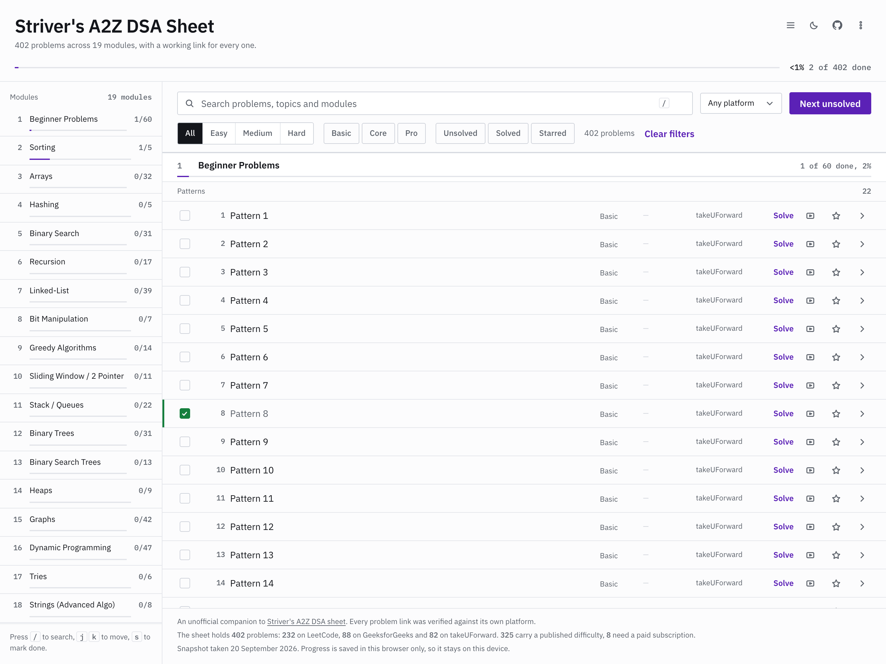

# Striver's A2Z DSA Sheet tracker

A fast, dependency-free tracker for [Striver's A2Z DSA Sheet](https://takeuforward.org/strivers-a2z-dsa-course/strivers-a2z-dsa-course-sheet-2/):
every problem in the sheet, with a direct **LeetCode** link when the sheet has one, a verified
**GeeksforGeeks** link when it doesn't, and the sheet's own takeuforward page as the last resort.
Progress lives in your browser's `localStorage`. No account, no backend, no tracking.

**Live:** https://geckguy.github.io/striver-a2z-sheet/



## What it does

- **All 402 practice problems** from the sheet, in the sheet's own order and module grouping
  (19 modules, from *Beginner Problems* to *Maths*).
- **One click to a real problem page.** Primary link is LeetCode, else a verified GeeksforGeeks
  page, else takeuforward's own practice page. Every other working link for that problem is kept
  as an alternate, so you can pick the platform you prefer.
- **Progress that survives a reload.** Solved and starred sets in `localStorage`, with export /
  import / reset. Nothing leaves your machine.
- **Filter and search** by module, difficulty (Easy/Medium/Hard), platform, Striver's tier
  (Basic/Core/Pro) and solved/starred state, plus instant search across title, topic and module.
- **Striver's own tier** (`Basic` / `Core` / `Pro`) sits beside the platform difficulty: 77 of the
  402 problems have no published Easy/Medium/Hard label (the sheet only links a LeetCode page for
  232 of them), so the tier fills that slot instead of pretending to be a difficulty.
- **Keyboard-first**: `/` search, `j`/`k` move, `s` toggle solved, `Esc` close.
- Light and dark themes, a mobile layout, and no build step or framework: three static files, two
  self-hosted font files and one JSON payload.

## Dataset

<!-- stats:start -->
| metric | value |
| --- | --- |
| problems | 402 |
| modules | 19 |
| leetcode_links | 232 |
| gfg_links | 88 |
| takeuforward_links | 82 |
| gfg_alt_links | 0 |
| leetcode_alt_links | 0 |
| with_difficulty | 325 |
| paid_leetcodes | 8 |
| with_video | 326 |
| with_article | 154 |
| with_alt_link | 320 |
<!-- stats:end -->

`scripts/check_readme.py` re-derives every number above from `site/data.json` and fails if any of
them (or the row count) disagrees, so this table cannot silently rot.

### Where the data comes from

| field | source | why |
| --- | --- | --- |
| module / topic order, titles, sheet links | takeuforward's sheet page payload | authoritative: the page ships its whole syllabus as JSON (`scripts/parse_tuf.py`) |
| LeetCode difficulty, paid flag | `leetcode.com/graphql` | LeetCode is the authority on its own problems |
| difficulty for the 82 problems with no LeetCode link | GeeksforGeeks pages (79 rows), codolio (14) | the page's own embedded `difficulty` field; each problem records which source it came from in `difficultySource` |
| GeeksforGeeks links | GeeksforGeeks itself | every candidate URL is fetched and checked against the page's own slug and title |
| link targets | the sheet, codolio, community sheet mirrors | cross-checked, see below |

The sheet page is a Next.js App Router document; `scripts/parse_tuf.py` decodes the streamed RSC
flight payload and reads two objects out of it: `sheet.sheet_syllabus` (the row tree) and
`syllabusOutline` (the canonical sidebar, which carries the real `/practice/dsa/<slug>` hrefs).

**Link precedence:** LeetCode (if the sheet lists one) → verified GeeksforGeeks → takeuforward
practice page. Two rules keep this honest:

- *LeetCode links are canonicalised and confirmed.* The sheet links 2 problems at slugs LeetCode has
  since renamed (`coin-change-2`, `implement-strstr`) and one at a login wall
  (`/accounts/login/?next=/problems/find-the-celebrity/`). Each is rewritten to the canonical
  `leetcode.com/problems/<slug>/` and the build refuses to ship a LeetCode link whose slug LeetCode's
  own API has not confirmed.
- *GeeksforGeeks links must beat every other problem in the sheet.* Comparing titles in isolation is
  not enough: GfG's "Union of Two Sorted Arrays" covers 75% of the sheet's "Intersection of two
  sorted arrays". A candidate is accepted only when the page's embedded slug identifies the same
  problem (equal, prefix, or the same stable numeric id after a rename), the sheet problem is the
  best match for that page anywhere in the sheet, and one page never backs two different problems
  (`scripts/titlematch.py`). 88 of the 170 problems without a LeetCode link get a GfG page this way;
  the other 82 keep Striver's own page. Further candidates were refused: 40 because the page
  title did not support the mapping and 5 because the page was already taken by a sibling problem
  (*Reverse an array* vs *Reverse an array 2* keep one page between them). The fallback is always
  correct; a coin-flip is not.

### What is *not* included

- The 38 concept-only lessons the sheet lists (e.g. *"How to Think Like a Programmer"*). They have
  no practice link and nothing to solve, so the tracker covers the 402 practice problems instead.
  The sheet's own counter reports 442 problems across 19 modules; the parsed payload holds 445
  items: 402 practice problems, 38 concept lessons and 5 contest rows (each with a contest URL,
  not a problem link).
- 9 codolio rows pointing at HackerRank / InterviewBit / SPOJ, which we could not verify.
- GeeksforGeeks pages we could not distinguish from a sibling problem (see above).
- Any progress sync between devices. `localStorage` is deliberately the only store.

## Running it locally

```sh
cd site && python3 -m http.server 8000   # http://localhost:8000
```

Opening `site/index.html` over `file://` shows a 26-problem demo subset instead of the real
dataset. A `file://` page has an opaque origin, so the browser refuses to read the sibling
`data.json`, and the page says so in a banner. Serve the folder over HTTP (above) for the full
402. Both paths are checked in a browser; a `file://` page rendering 26 rows with that banner and
no console errors is the expected result.

One caching note, learned the hard way: GitHub Pages serves every file with
`cache-control: max-age=600`, so a browser can revalidate `index.html` while still holding a
cached `app.js` from an earlier deploy. `scripts/stamp_assets.py` gives both assets a
content-hashed URL (run by the deploy workflow) so that pairing cannot happen, and the script
tolerates markup it does not recognise: missing nodes skip their update instead of throwing, and
anything unexpected is reported in the page's own banner rather than leaving a half-drawn page.

## Regenerating the dataset

```sh
python3 scripts/parse_tuf.py         # data/raw/tuf_sheet.html -> data/raw/base_items.json
python3 scripts/fetch_leetcode.py    # -> data/raw/leetcode.json      (difficulty, premium flag)
python3 scripts/fetch_lc_extra.py    # -> data/raw/leetcode_extra.json (renamed + extra LC links)
python3 scripts/match_gfg.py         # -> data/raw/gfg_final.json      (candidates, verified)
python3 scripts/crosscheck.py        # -> data/raw/crosscheck.md
python3 scripts/build_data.py        # -> site/data.json  (validates, then writes)
python3 scripts/verify_links.py      # last gate: every shipped problem link, over HTTP
python3 scripts/check_readme.py      # this README vs site/data.json
python3 scripts/stamp_assets.py      # app.js/styles.css -> content-hashed URLs (also run by CI)
```

`build_data.py` refuses to write a dataset that fails its invariants: duplicate ids, non-contiguous
order, non-http URLs, a platform whose URL does not belong to it, a `stepTitle` that disagrees with
its step, an unconfirmed LeetCode link, or step counts that do not sum to the problem count.
`match_gfg.py` refuses to overwrite its output with an empty match set. `check_readme.py` fails if
any number in the table above (or the row count) drifts from `site/data.json`. Verified by
perturbing a cell and deleting a row, which both fail as they should.

### Evidence kept in the repo

- `data/raw/crosscheck.md`: our extraction vs codolio's independent copy of the same sheet:
  **96.4% of our LeetCode slugs are confirmed by the second source** (214 shared of 222).
- `data/raw/verify_links.json`: HTTP status *and* page title for every shipped takeuforward and
  GeeksforGeeks link, re-checked after each data change.
- `data/raw/link_health.json` + `link_health_report.md`: a 1,124-URL sweep of every link in the
  sheet (articles 159/159 and videos 301/301 return 200; LeetCode answers 403 to any non-browser
  client and was instead confirmed through its API and in a real browser, 220/220).
- `data/raw/gfg_final_report.md`: the GfG match rate, every refusal with its reason.
- `data/raw/gfg_report.md`: the candidate-generation pass, which also documents that
  GeeksforGeeks returns **HTTP 200 for a problem that does not exist**, so status codes alone
  prove nothing there.
- `data/raw/codolio_report.md`: the codolio endpoint and its measured counts.

## Credits and disclaimer

Unofficial and unaffiliated. The sheet, its ordering and its problem selections are
**Striver / takeuforward's** work. Go read [takeuforward.org](https://takeuforward.org/). Problems
belong to their platforms (LeetCode, GeeksforGeeks). The code here is MIT; the derived data is
reproducible from the public sources above.

Built because every existing copy of this sheet is either a spreadsheet, a paywalled tracker, or a
page that can't tell you which of your solved problems were LeetCode and which were GfG.
